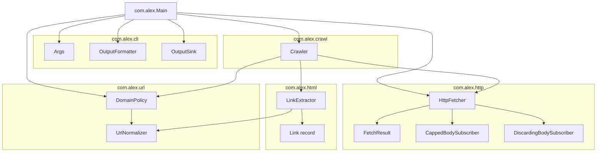
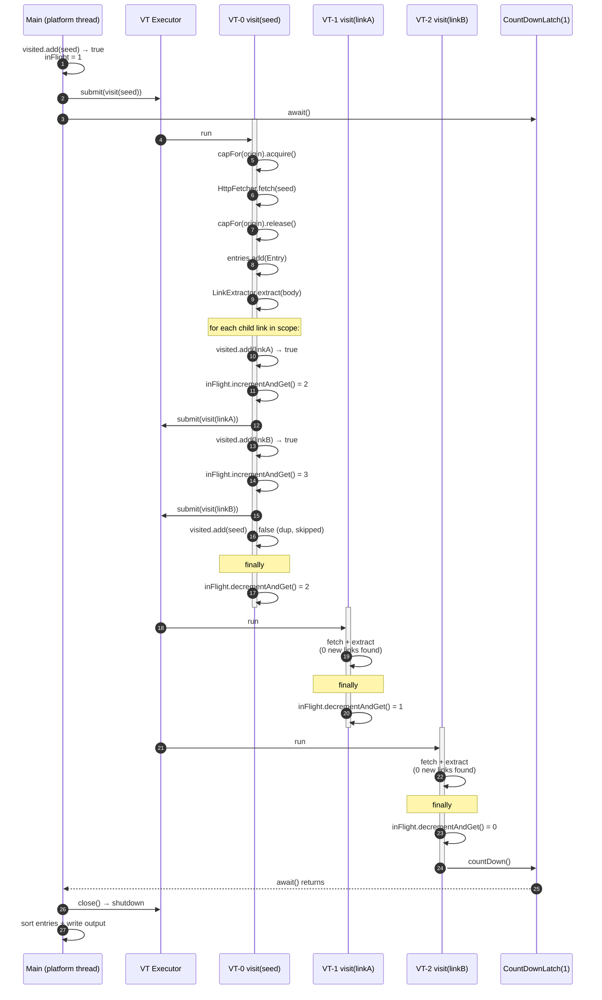
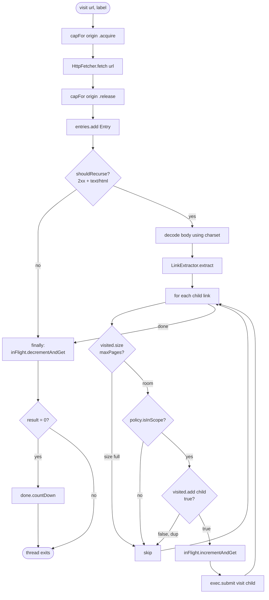
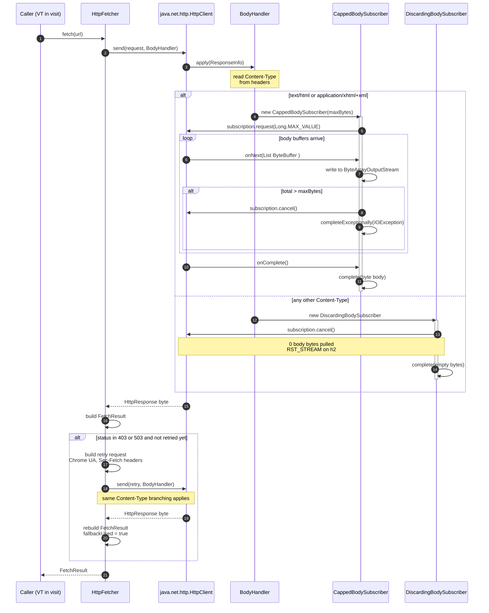

# Diagrams

Four views into the crawler:

- **[A — Component / package layout](#a--component--package-layout)** — where the code lives.
- **[B — Parent / child virtual-thread flow](#b--parent--child-virtual-thread-flow)** — the orchestration sequence.
- **[C — Per-thread `visit()` lifecycle](#c--per-thread-visit-lifecycle)** — what one virtual thread does end-to-end.
- **[D — HTTP fetch dispatch with body-handler branching](#d--http-fetch-dispatch)** — the inside of `HttpFetcher.fetch(...)`.

---

## A — Component / package layout

Direction of arrows = "depends on". `cli` depends on everything; nothing depends on `cli`.

---

## B — Parent / child virtual-thread flow

The seed thread fans out. Each child runs on its own virtual thread, can fan out further, and the run finishes when `inFlight` returns to zero — that's the latch trigger.

**Invariants this diagram encodes:**

- **Add-before-schedule.** Every `submit()` is preceded by a `visited.add(url) → true`. The `add()` boolean *is* the dedup gate — there's no `contains` check.
- **Pre-increment in parent.** `inFlight.incrementAndGet()` runs in the **parent**, before `submit()`, so the child can never observe `inFlight = 0` between its scheduling and its `decrementAndGet`. If the parent decremented first, the latch could fire too early.
- **Single-shot latch.** `CountDownLatch(1)` fires exactly once when `inFlight` hits zero. Any thread can be the one to call `countDown()`.

---

## C — Per-thread `visit()` lifecycle

Inside one virtual thread. The `finally` block is the only path that decrements `inFlight` — every code path leads to it, including exceptions.

**Why the per-origin semaphore wraps only `fetch(...)`:**
the wait happens in the network call, so the lock is held for exactly the duration of the I/O. CPU-only steps (`extract`, `add`, `submit`) run outside the lock — they wouldn't benefit from being serialized per-origin and would just throttle fan-out.

---

## D — HTTP fetch dispatch

Inside `HttpFetcher.fetch(...)`. The `BodyHandler` is invoked **after** response headers arrive and **before** body bytes start flowing — so we can branch on `Content-Type` without paying for the body.

**Why the cancel in `DiscardingBodySubscriber` is load-bearing:**
the JDK's `BodySubscribers.replacing(...)` and `discarding()` both back onto `NullSubscriber`, which calls `request(Long.MAX_VALUE)` and *drains* the body before completing. Same network cost as a full GET. The custom subscriber calls `subscription.cancel()` in `onSubscribe` — on HTTP/2 that's a `RST_STREAM` frame, on HTTP/1.1 it closes the connection. Either way zero body bytes flow.
